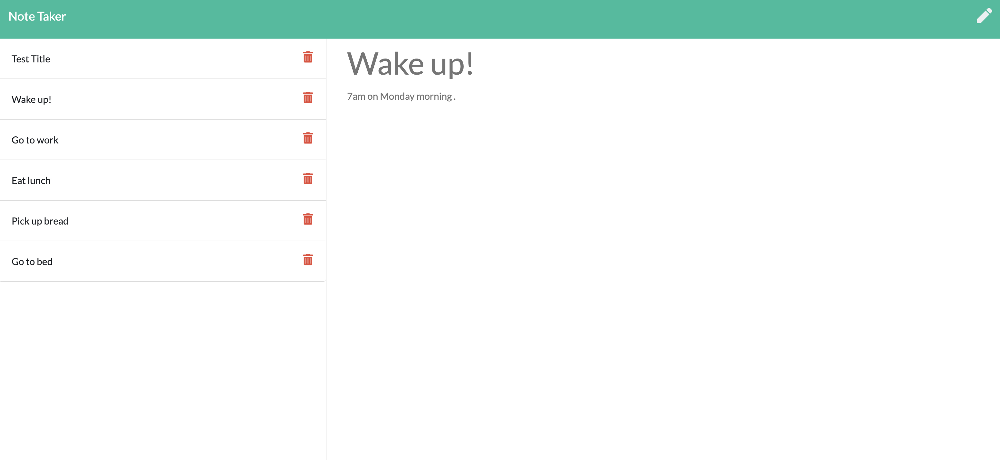

# onPoint Note Taking
## by Aaron Rosenblatt

#### I wrote code using Express.js back end to create a note taking application that saves and retrieves data from a JSON file. I created the back end by connecting an already created front end. The back end includes newly created HTML and API routes. The HTML routes return the notes.html and index.html files. The API routes include a GET that reads the db.json file and returns all saved notes as JSON. Also, the API routes has a POST receives a new note to save on the request body, adds it to the db.json file, and then returns the new note to the client. When the API route returns the new note to the client, it gives each note a unique id when it is saved. 

#### When the user opens onPoint Note Taking, a landing page appears with a link to a notes page. Clicking on the link takes the user to a page with existing notes listed in the left-hand column, plus empty fields to enter a new note title and the note’s text in the right-hand column. When the user enters text into the note's title and text field, a Save icon appears in the navigation at the top of the page. Clicking on the Save icon allows the newly entered note to save and appear in the left-hand column with the other existing notes. If the user clicks on an existing note in the list in the left-hand column then that note appears in the right-hand column. Finally, if the user clicks on the Write icon in the navigation at the top of the page, empty fields to enter a new note title and the note’s text will appear in the right-hand column.

### The onPoint Note Taking app can be viewed and used here: https://rosenblatt-onpoint-notetaking.herokuapp.com/   

### The GitHub repository for onPoint Note Taking can be viewed here: https://github.com/noplur/onPoint-Note-Taking

### Here is a screenshot of a sample from onPoint Note Taking:
### 